---
# You don't need to edit this file, it's empty on purpose.
# Edit theme's home layout instead if you wanna make some changes
# See: https://jekyllrb.com/docs/themes/#overriding-theme-defaults
layout: default
---
# Apprenda Audit Event SIEM Export Tools #

To support SIEM tools using Syslog transport (either RFC 3164 or RFC 5424), the Apprenda Cloud Platform can be extended using its native extensibility points to ship event records generated by the platform for a variety of workflows to receiving service, including industry-standard platforms like Microfocus ArcSight.

Support is available for both "simple" message formats, with support for the ArcSight Common Event Format for enriched tagging and sorting capabilites in the SIEM ecosystem coming soon.

## Installation ##
There are several steps to installation of the Syslog-transport based SIEM integration on an Apprenda Cloud Platform instance.
### 1. Obtaining the package ###
The SIEM integration components include a platform [addon](http://docs.apprenda.com/8-1/addons) and an [extension](http://docs.apprenda.com/8-1/extensions) which provide forwarding capabilities to publish audited events from the platform to a pre-configured SIEM receiver such as ArcSight Logger, Kiwi Syslogd, or any other Syslog-transport system. The latest compiled releases of the Syslog forwarder and updated documentation are available from the project's GitHub [releases](https://github.com/apprenda/AuditEvents-SIEM/releases) page.
### 2. Building from Source ###
The Apprenda Audit Events and SIEM project uses [cake](https://cakebuild.net) for build management; after cloning the repository, run the `build.ps1` script from the root of the repo to build. MSBuild 14 or later features are required on the build machine; C# 6 language features are used for conciseness of the code. Cake will automatically install needed build process components through nuget, and produce the build artifacts needed for the addon and extension in the `./out` directory.
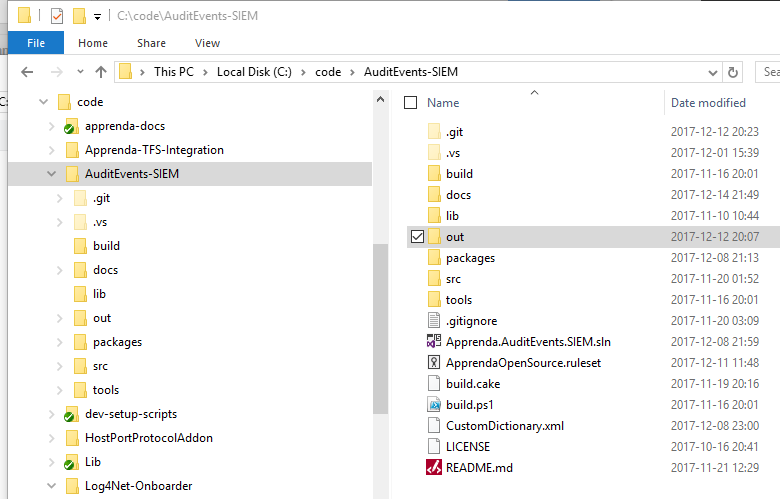
### 3. The Operator Dev Team ###
The extensibility service runs in a development team and needs to have an addon provisioned in order to provide its configuration in a standardized way. The recommended practice is to have a Platform Operator development team to host such extensibility services, and provision addons as needed into that development team. The Platform Operator development team and a developer account within that team will be used for deploying the extension WCF service application later in these instructions.
### 4. Creating the Add-on ###
The Syslog Configuration addon provides a connection definition UI for off-platform Syslog receivers.
  1. As designed, an new copy of the add-on should be added for each Syslog endpoint to be supported by the platform.
  1. On your running platform logged in as a user with System Operations Center access, access the Configuration menu, Platform Add-Ons option.
  1. Click the New Add-On button
  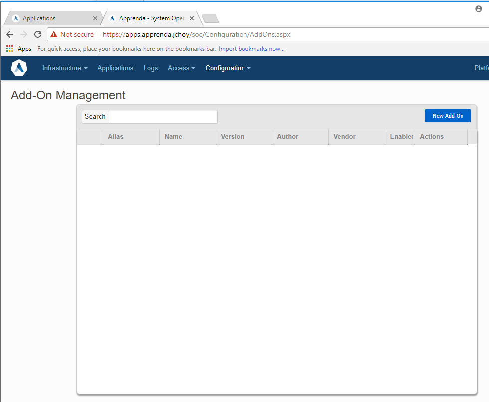
  1. The recommended alias for the addon is `SyslogConfiguration`. 
  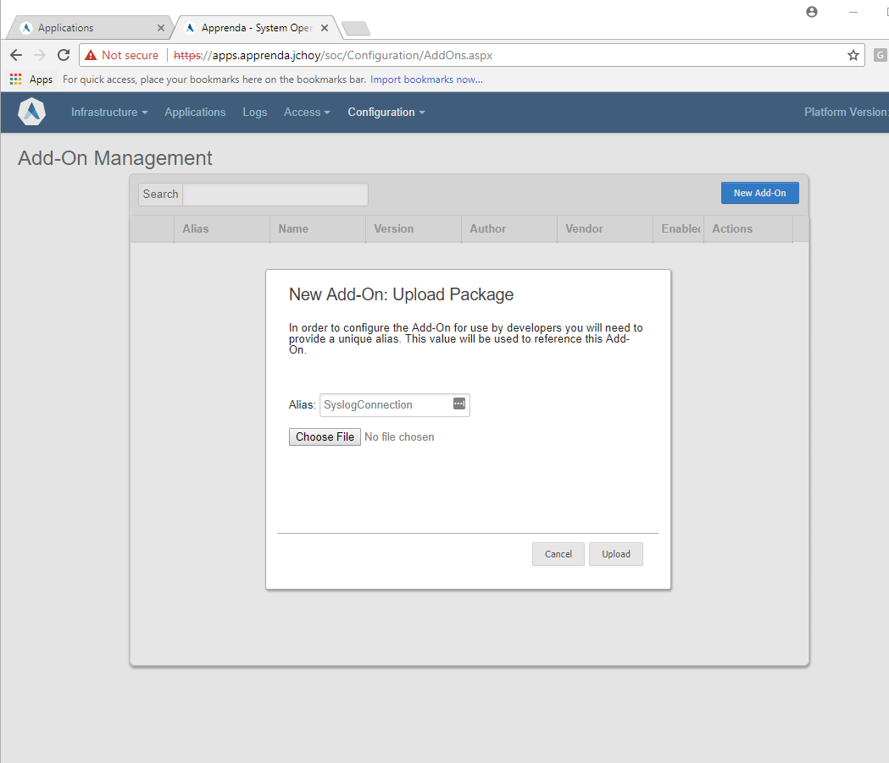
  1. The archive is `Apprenda.SyslogAddon.zip` from the release download.
  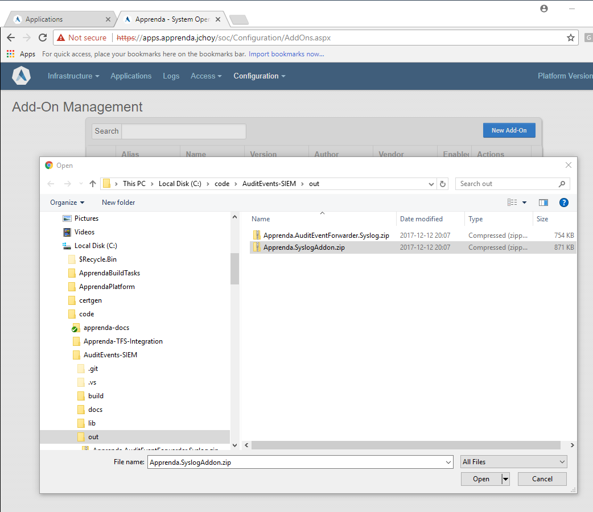
  1. Click `Edit` to configure the addon.
  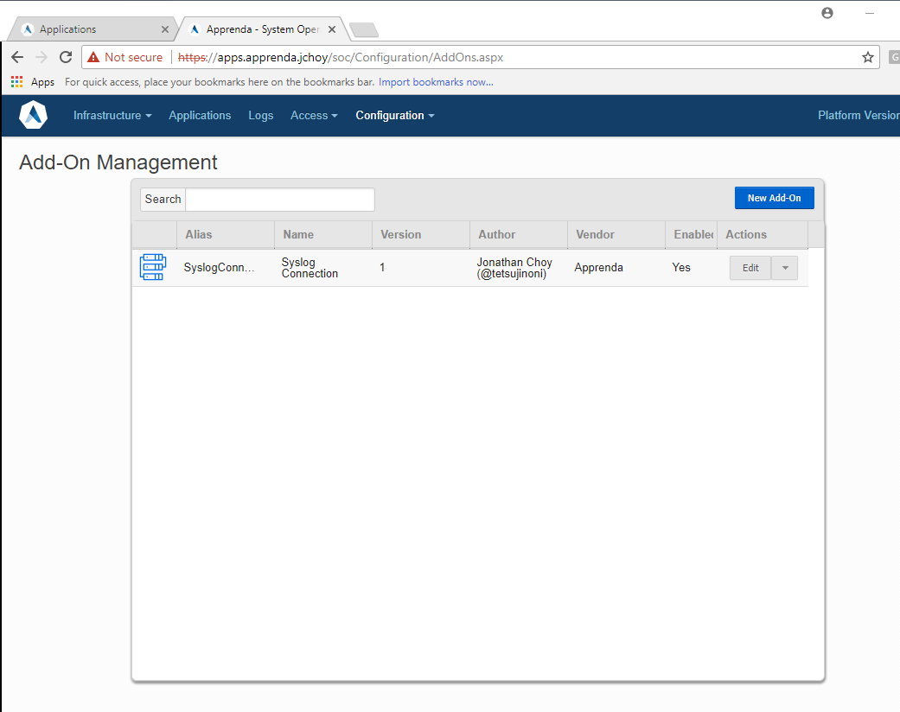
     1. Provisioning properties are unused. The `Location`, `User`, and `Password` properties of the General tab are unused in this add-on.
     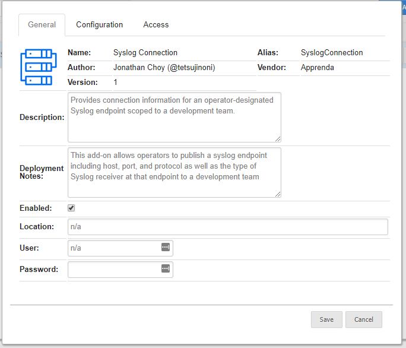
     2. On the Configuration tab, several properties must be configured to match your Syslog receiver's properties.
     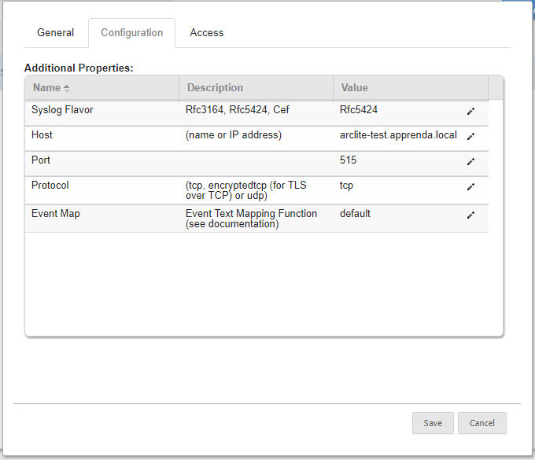
        1. Syslog Flavor: There are two Syslog RFCs which are supported by the Audit Event SIEM project, and an enhanced message format supported by some SIEM products. Choose whether to use the simple RFC3164 Syslog message format, RFC5424 Syslog messages, or ArcSight CEF messages in RFC5424 messages, as is appropriate for the Syslog receiver which is being configured.
        2. Host: the hostname or IP address of the Syslog receiver.
        3. Port: the listening port of the Syslog receiver.
        4. Protocol: the transport protocol, from 'tcp', 'encryptedtcp', or 'udp'. Encrypted TCP is TLS encapsulation over TCP, as supported by [SyslogNet]().
        5. Event Map: The Audit Events SIEM project supports configurable message formatters, to allow customization of the details transmitted to the Syslog receiver and compatibility with multiple versions of the Apprenda Cloud Platform, as new Audited events may be added to the platform from release to release. A default mapper compatible with Apprenda Cloud Platform 8.1 is included as the `default` Event Map.
     1. On the Access tab, configure the Addon for restricted development team access and a single instance per development team.
    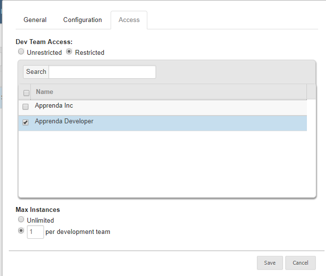
        1. It is recommended that the Syslog addon only be provisioned on the Operator development team or teams.
        2. There should be only one instance of the Syslog addon per development team. 
### 5. Test the Add-on Configuration ###
Using the Actions dropdown, select "Test" for the addon to attempt a connection to the chosen endpoint, and send a test Syslog message from the platform to the Syslog receiver. 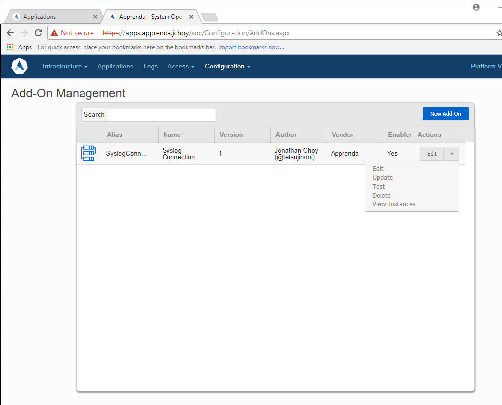 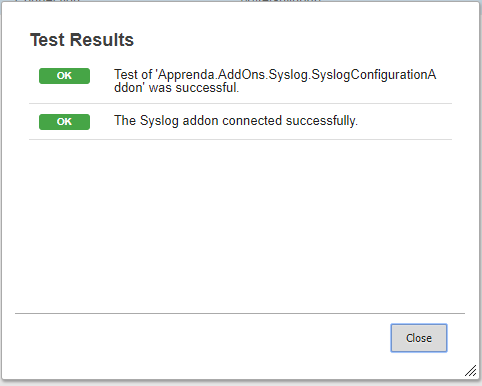
### 6. Provisioning the Add-on to the Operator Team ###
1. Connect to the Developer Portal as a member of the Operator development team.
1. Provision the Add-on into the development team
    1. Click the Add-on management control.
    1. Select the Syslog Connection addon and "Manage".
    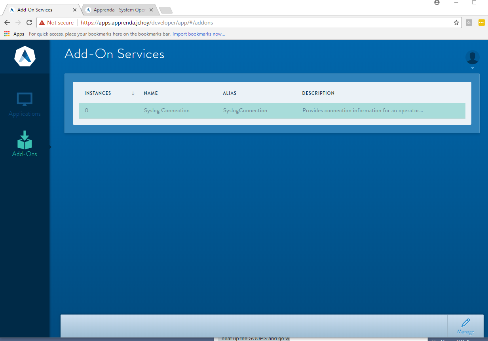
    1. Add an instance of the addon.
    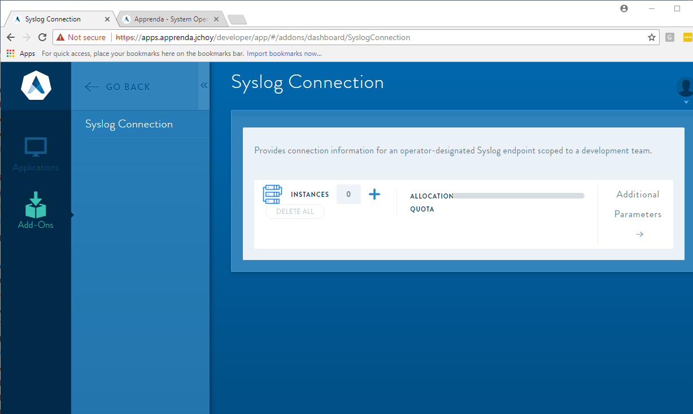
    1. The instance alias should be `syslogconnection` to match the Extension app.config. 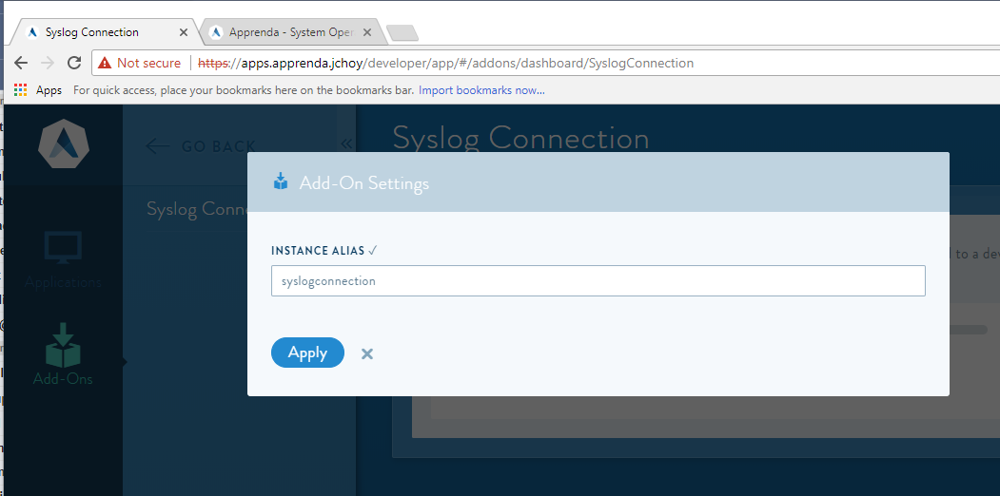 

### 7. Creating the SIEM Forwarder  workload ###
1. Connect to the Developer Portal as a member of the Operator development team.
1. Add the Extension application to the development team.
    1. Click the Application management control.
    2. Add an application by clicking New, giving the application a meaningful name for the Syslog destination which will be receiving the forwarded event information, and an alias. The alias will be important for the next step.
    3. Upload the extension archive from the distribution package or built source code: `Apprenda.AuditEventForwarder.Syslog.zip`.
    1. Navigate to the Application Dashboard
    1. Promote the application to Sandbox
### 8. Platform Registry Settings ###
1. Add a registry setting to the Platform Registry through the  System Operations Center. 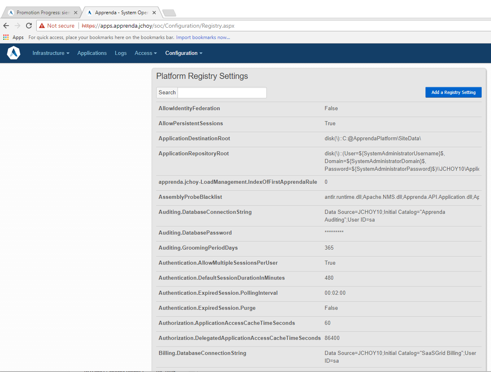
2. The registry seting should be `Telemetry.AuditEventForwardingTarget` and its value will be `ALIAS(v1)/SysLogAuditForwarder` (The on-platform abbreviated URI for a platfor-routed WCF service endpoint) 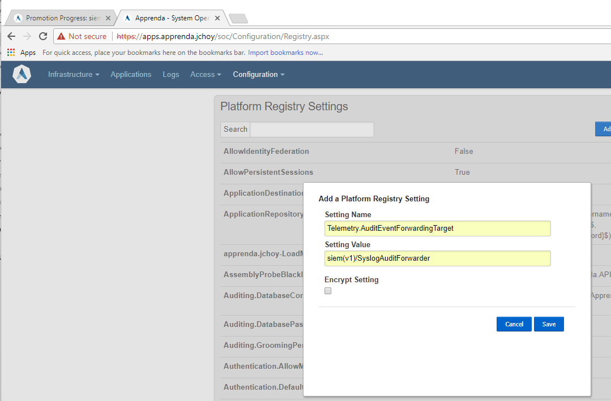
### 9. Update Considerations ###
There is no queueing or replay of audited event messages in the platform auditing facility, so a maintenance window for Syslog receivers will require preplannig if platform events going unrecorded off-platform is a policy issue. The platform supports multi-value `Telemetry.AuditEventForwardingTarget` settings in order to transmit to multiple, potentially disparate, systems.

For maintenance purposes, the `Telemetry.AuditEventForwardingTarget` value may be set blank before patching the Forwarder Workload, to prevent the platform logging errors when forwarding through the extension fails during patching.